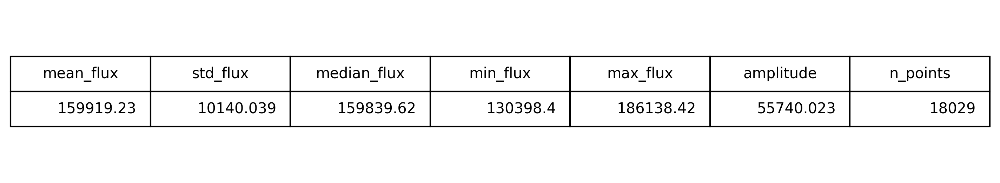

# Light Curve Feature Extractor

[](https://colab.research.google.com/drive/1yqEvt24xh5nN2Dg3hpk4MAHT0_VXZNRT?authuser=1#scrollTo=baEnCZaxdOL3)

Extract statistical features from TESS light curves using Python.


## Features

- Download TESS light curves
- Extract statistical properties
- Compute variability descriptors
- Export feature tables
- Save CSV outputs
- Generate feature previews


## Dataset

Mission:

**TESS (Transiting Exoplanet Survey Satellite)**

Target:

**AB Dor**


## Extracted Features

| Feature | Value |
|---|---:|
| Mean Flux | 159919.23 |
| Standard Deviation | 10140.04 |
| Median Flux | 159839.62 |
| Minimum Flux | 130398.40 |
| Maximum Flux | 186138.42 |
| Amplitude | 55740.02 |
| Number of Points | 18029 |


## Output Preview

### Feature Table



### CSV Output

Stored in:

```text
outputs/features.csv
```


## Scientific Context

Feature extraction is an important preprocessing step for:

- Variable star classification
- Machine learning workflows
- Explainable AI studies
- Time-series astronomy
- Astronomical data mining

This project extracts statistical descriptors from TESS observations of AB Dor and prepares them for future ML pipelines.

